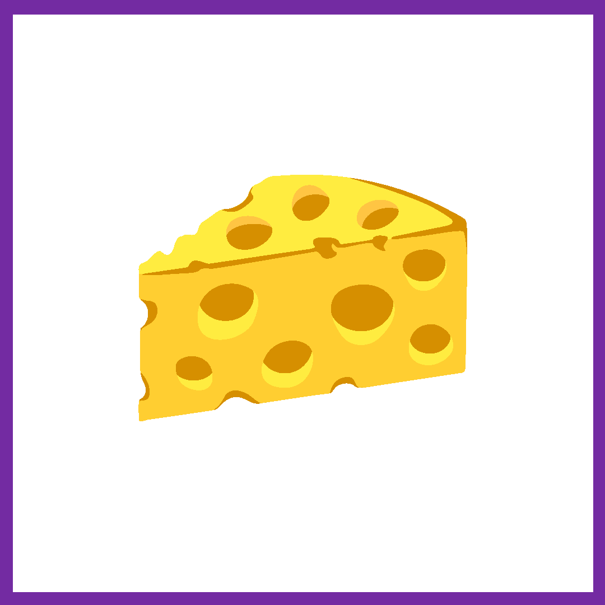

<!-- Improved compatibility of back to top link: See: https://github.com/othneildrew/Best-README-Template/pull/73 -->

<!--
*** Thanks for checking out the Best-README-Template. If you have a suggestion
*** that would make this better, please fork the repo and create a pull request
*** or simply open an issue with the tag "enhancement".
*** Don't forget to give the project a star!
*** Thanks again! Now go create something AMAZING! :D
-->

<!-- PROJECT SHIELDS -->
<!--
*** I'm using markdown "reference style" links for readability.
*** Reference links are enclosed in brackets [ ] instead of parentheses ( ).
*** See the bottom of this document for the declaration of the reference variables
*** for contributors-url, forks-url, etc. This is an optional, concise syntax you may use.
*** https://www.markdownguide.org/basic-syntax/#reference-style-links
-->
[![Contributors][contributors-shield]][contributors-url]
[![LinkedIn][linkedin-shield]][linkedin-url]

<!-- PROJECT LOGO -->
 

  

<h3 align="center">Charcuterie Board Generator</h3>

  

    Build a Charcuterie Board that will astound and amaze! 
     
    <a href="https://github.com/malloryjoy/charcuterieboard"><strong>Explore the docs »</strong></a>
     
     
    <a href="https://github.com/malloryjoy/charcuterieboard">View Demo</a>
    &middot;
    <a href="https://github.com/malloryjoy/charcuterieboard/issues/new?labels=bug&template=bug-report---.md">Report Bug</a>
    &middot;
    <a href="https://github.com/malloryjoy/charcuterieboard/issues/new?labels=enhancement&template=feature-request---.md">Request Feature</a>
  

<!-- TABLE OF CONTENTS -->

  
Table of Contents

  <ol>
    <li>
      <a href="#about-the-project">About The Project</a>
      <ul>
        <li><a href="#built-with">Built With</a></li>
      </ul>
    </li>
    <li>
      <a href="#getting-started">Getting Started</a>
    </li>
    <li><a href="#usage">Usage</a></li>
    <li><a href="#roadmap">Roadmap</a></li>
    <li><a href="#contributing">Contributing</a></li>
    <li><a href="#notes">Notes</a></li>
    <li><a href="#contact">Contact</a></li>
    <li><a href="#acknowledgments">Acknowledgments</a></li>
  </ol>

<!-- ABOUT THE PROJECT -->
## About The Project

[![Product Name Screen Shot][product-screenshot]](https://example.com)

This project takes a provided type of cheese and creates a diverse charcuterie board around it. Each board features 1-3 types of cheese, as well as complementary items like fruits, crackers, nuts, and more! 

(<a href="#readme-top">back to top</a>)

### Built With

* [![Javascript][Javascript.js]][Javascript-url]
* [![Typescript][Typescript.js]][Typescript-url]
* [![React][React.js]][React-url]
* [![Angular][Angular.io]][Angular-url]
* [![HTML][HTML.io]][HTML-url]
* [![CSS][CSS.io]][CSS-url]

(<a href="#readme-top">back to top</a>)

<!-- USAGE EXAMPLES -->
## Usage

This project was created with Javascript, available with classic Vanilla and three associated Javascript frameworks. Use it for your next dinner party, Super Bowl, or any friendly gathering! 

(<a href="#readme-top">back to top</a>)

<!-- ROADMAP -->
## Roadmap

- [x] Create Basic Landing Pages (HTML/CSS)
    - [x] Welcome Page to choose Javascript framework 
    - [x] Page to choose Primary cheese and necessary filters 
    - [x] Page to display charcuterie board
- [x] "Form" to accept primary cheese provided by user (HTML)
- [x] Filter Feature for Form that creates cheeseboards that do not include meat, nuts, or wine pairings (Javascript)
- [x] Cheeseboard Generator that creates Cheese Board based off primary cheese provided by the user (Javascript)
- [ ] Create corresponding cheeseboard pairings (Javascript)
- [ ] Convert selector/generator/filter script from Vanilla Javascript to React, Angular, and Node with Typescript
 

See the [open issues](https://github.com/github_username/repo_name/issues) for a full list of proposed features (and known issues).

(<a href="#readme-top">back to top</a>)

<!-- NOTES -->
## Notes

As is, this project is a great start for any gourmand! That said, potential growth for this project could come from a separate "visualizer" section that includes presentation ideas (fanning bread slices, charcuterie flowers, etc.) as well as a brief shopping window for cheese boards and cheese knife sets. In addition, I've created filters for wine-free, nut-free, and meat-free charcuterie boards, but I could also provide a "gluten free" option that eliminates the bread/cracker component! Lastly, I purposefully did not feature bacon jam as a spread/condiment option to better ease the "vegetarian" filter. An advanced filter feature that can eliminate individual items in an option would be a unique way to elevate the custom experience of this generator! 

(<a href="#readme-top">back to top</a>)

<!-- CONTACT -->
## Contact

Your Name - [@malloryjoycreates](https://instagram.com/malloryjoycreates) - malloryjoy13@gmail.com

Project Link: [GitHub](https://github.com/malloryjoy/charcuterie)

(<a href="#readme-top">back to top</a>)

(<a href="#readme-top">back to top</a>)

<!-- MARKDOWN LINKS & IMAGES -->
<!-- https://www.markdownguide.org/basic-syntax/#reference-style-links -->
[contributors-shield]: https://img.shields.io/github/contributors/malloryjoy/charcuterie.svg?style=for-the-badge
[contributors-url]: https://github.com/malloryjoy
[forks-shield]: https://img.shields.io/github/forks/github_username/repo_name.svg?style=for-the-badge
[forks-url]: https://github.com/github_username/repo_name/network/members
[stars-shield]: https://img.shields.io/github/stars/github_username/repo_name.svg?style=for-the-badge
[stars-url]: https://github.com/github_username/repo_name/stargazers
[issues-shield]: https://img.shields.io/github/issues/github_username/repo_name.svg?style=for-the-badge
[issues-url]: https://github.com/github_username/repo_name/issues
[license-shield]: https://img.shields.io/github/license/github_username/repo_name.svg?style=for-the-badge
[license-url]: https://github.com/github_username/repo_name/blob/master/LICENSE.txt
[linkedin-shield]: https://img.shields.io/badge/-LinkedIn-black.svg?style=for-the-badge&logo=linkedin&colorB=555
[linkedin-url]: https://www.linkedin.com/in/malloryjoy/
[product-screenshot]: screenshot.png
[Javascript.js]: https://img.shields.io/badge/javascript-grey?logo=javascript
[Javascript-url]: https://www.javascript.com/
[Typescript.js]: https://img.shields.io/badge/typescript.js-000000?style=for-the-badge&logo=typescriptdotjs&logoColor=white
[Typescript-url]: https://www.typescriptlang.org/
[React.js]: https://img.shields.io/badge/React-20232A?style=for-the-badge&logo=react&logoColor=61DAFB
[React-url]: https://reactjs.org/
[Angular.io]: https://img.shields.io/badge/Angular-DD0031?style=for-the-badge&logo=angular&logoColor=white
[Angular-url]: https://angular.io/
[HTML.io]: https://img.shields.io/badge/HTML-1f75fe
[HTML-url]: https://developer.mozilla.org/en-US/docs/Web/HTML
[CSS.io]: https://img.shields.io/badge/CSS-991ae8?style=for-the-badge&logo=CSS&logoColor=white
[CSS-url]: https://developer.mozilla.org/en-US/docs/Web/CSS

